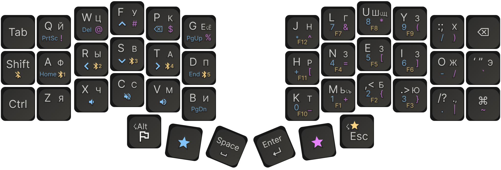
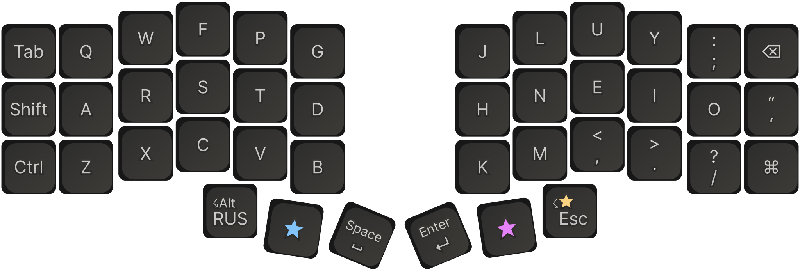
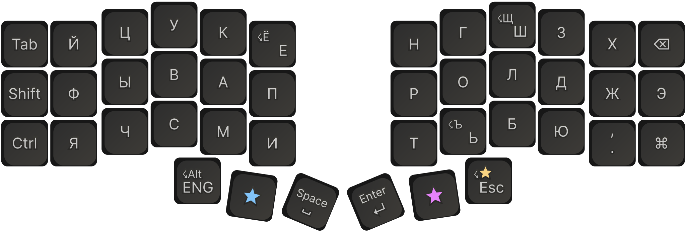
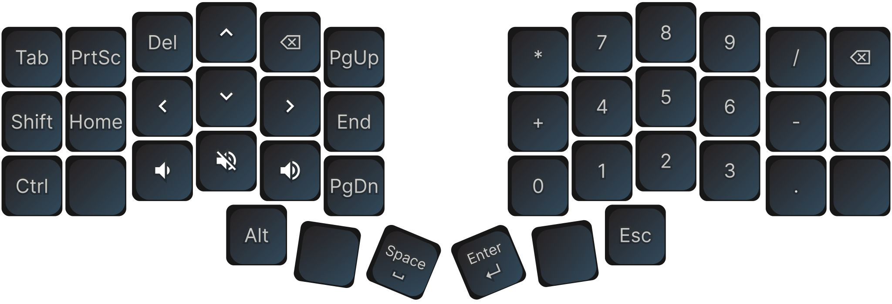
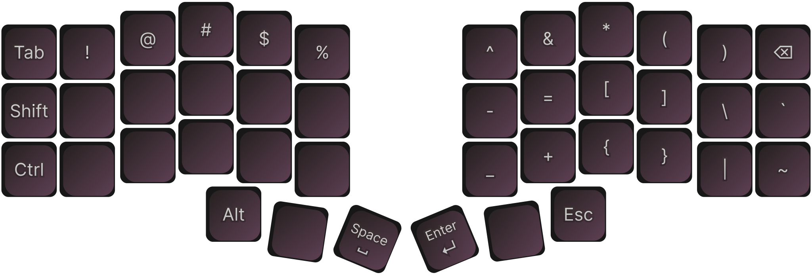
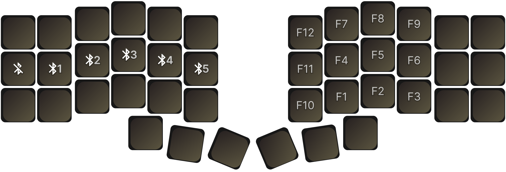

# ZMK Firmware for a Wireless Corne (Colemak, Beginner-Friendly)

This is a simple, “can’t really mess it up” ZMK firmware/keymap for a wireless Corne using a **Colemak** base layout, aimed at people coming from a full-size keyboard.

- **Beginner-friendly**: the layout is intentionally intuitive and logically grouped.
- **Low-risk**: you can explore layers without fear of “pressing the wrong thing” and getting lost.
- **Colemak-first**: the default/base layer is Colemak (not QWERTY).
- **Visual docs**: each layer is documented as an image below.

## Keyboard Layout

### Default Layer (QWERTY)

### Russian Layer

### Lower Layer (Numbers & Navigation)

### Raise Layer (Symbols)

### F Layer (Function Keys & Bluetooth)

## Language Switching

- **Important**: this keymap sends **Ctrl+0** (English) and **Ctrl+1** (Russian) for OS-level input language switching. For it to actually switch languages, you must bind/set your OS language switch hotkeys to those combos.
- **Keymap behavior**:
  - **Ctrl+0**: switch OS input language to English + go to the default layer
  - **Ctrl+1**: switch OS input language to Russian + go to the Russian layer
  - **LAlt (tap)**: toggle default/russian (via `&to_eng` / `&to_rus`)